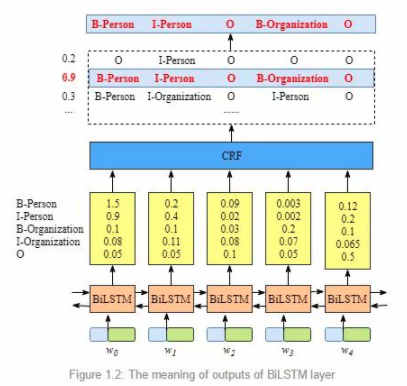

# 条件随机场面试题

Author: 李文乐; Email: cocoleYY@outlook.com

## 1. 简单介绍条件随机场 ##

------------------------------------------------------------
条件随机场（conditional random field，简称 CRF）是给定一组输入随机变量条 件下另一组输出随机变量的条件概率分布模型，其特点是**假设输出随机变量构成马尔可夫随机场**，是一种鉴别式机率模型，是随机场的一种，常用于标注或分析序列资料，如自然语言文字或是生物序列。
如同马尔可夫随机场，条件随机场为无向图模型，图中的顶点代表随机变量，顶点间的连线代表随机变量间的相依关系，在条件随机场当中，随机变量 Y 的分布为条件机率，给定的观察值则为随机变量 X。   
原则上，条件随机场的图模型布局是可以任意给定的，一般**常用的布局是链接式**的架构，链接式架构不论在训练（training）、推论（inference）、或是解码（decoding）上，都存在有效率的算法可供演算。
条件随机场跟隐马尔可夫模型常被一起提及，条件随机场对于输入和输出的机率分布，没有如隐马尔可夫模型那般强烈的假设存在 [补充：因为HMM模型假设后面状态和前面无关]。 

##2. 条件随机场预测的维特比算法求解过程：  

输入：模型特征向量F(y,x)和权值向量w，观测序列$x=(x_1,x_2,…,x_n)$;  
输出：最优路径$y^*=(y_1^*,y_2^*,…,y_n^*) $

初始化：
$$
\delta_{1}(j)=w \cdot F_{1}\left(y_{0}=\operatorname{start}, y_{1}=j, x\right), \quad j=1,2, \cdots, m
$$
递推：
$$
\delta_{i}(l)=\max _{1<j<m}\left\{\delta_{i-1}(j)+w \cdot F_{i}\left(y_{i-1}=j, y_{i}=l, x\right)\right\}, \quad l=1,2, \cdots, m
$$

$$
\Psi_{i}(l)=\arg \max _{1 \leqslant j \leqslant m}\left\{\delta_{t-1}(j)+w \cdot F_{i}\left(y_{i-1}=j, y_{i}=l, x\right)\right\}, \quad l=1,2, \cdots, m
$$

终止：
$$
\max _{y}(w \cdot F(y, x))=\max _{1<j<m} \delta_{n}(j)
$$

$$
y_{n}^{*}=\arg \max _{1 \leqslant j \leqslant m} \delta_{n}(j)
$$

返回路径:
$$
y_{i}^{*}=\Psi_{i+1}\left(y_{i+1}^{*}\right), \quad i=n-1, n-2, \cdots, 1
$$

##3. 链式条件随机场[chain-structured CRF]条件概率公式：  

$$
P(\mathbf{y} \mid \mathbf{x})=\frac{1}{Z} \exp \left(\sum_{j} \sum_{i=1}^{n-1} \lambda_{j} t_{j}\left(y_{i+1}, y_{i}, \mathbf{x}, i\right)+\sum_{k} \sum_{i=1}^{n} \mu_{k} s_{k}\left(y_{i}, \mathbf{x}, i\right)\right)
$$

## 4. HMM、MEMM和CRF模型的比较  

* HMM模型是对转移概率（隐藏状态转移到隐藏状态的概率）和表现概率（隐藏状态到观察状态的概率）直接建模，统计共现概率；
* MEMM模型是对转移概率和表现概率建立联合概率，统计时统计的是条件概率，而非共现概率。MEMM容易陷入局部最优，主要因为是MEMM只在局部做归一化；
* CRF模型则统计的是全局概率，在归一化时考虑了数据在全局的分布，而不仅仅是局部归一化，这样也就解决了MEMM中的标记偏置问题；

## 5. 注意要点  

----------

- 概率图模型的表示  
概率图模型结合了概率论和图论的知识，用图模式(节点和边)表达基于概率相关关系的模型的总称。图模型的引入使得人们在处理复杂概率问题时，可以将复杂问题进行适当的分解；表示理论将图模型分为如下两个类别：贝叶斯网络[Bayesian Netword]和马尔科夫随机场[Markov Random Field]，前者采用有向无环图来表达事件的因果关系，后者采用无向图来表达变量间的相互作用；  

- 贝叶斯网络和马尔科夫随机场的分解计算问题  
贝叶斯网络中每个节点都对应一个先验概率分布或者条件概率分布，因此整体联合概率分布可以直接分解为所有单个节点分布的乘积；对于马尔科夫随机场，由于变量间没有明确的因果关系，它的联合概率分布通常会表达为一系列势函数[Potential Function]的乘积，因为乘积之和通常不为1，所以要进行归一化才能成为一个有效的概率分布。  

- 对于概率图模型，模型学习的精度通常受三方面影响
	- 语料库样本集对总体的代表性；  
	- 模型算法理论基础及所针对的问题。不同模型的理论不同，所擅长处理的NLP任务也不同，比如：朴素贝叶斯模型处理短文本分类效果很好，最大熵模型在处理中文词性标注表现很好，条件随机场处理中文分词，语义组块等方便精度很好，Semi-CRF在处理命名实体识别精度很好。  
	- 模型算法的复杂度。属于工程问题，一般讲，要求模型参数估计的越精确，模型复杂度越高，学习时间越长，推断和预测的精度也越高。  

- Bi-LSTM-CRF算法解析  
	
	
	
	  Bi-LSTM-CRF模型的输入是每个单词的词向量，经过双向LSTM层提取特征并输出为5个label的得分，再将该得分输入进CRF层，得到这句话最终最大可能的识别标签。因为BiLSTM层得到的label并不总是满足实际情况，CRF层能够添加一些约束使得预测标签是有效的。这些约束便是从训练数据的过程中学习得到的。

- 常见的概率图模型中，哪些是生成模型和哪些是判别模型？

    - 生成式 模型是对联合概率分布$P(X,Y,Z)$进行建模，在给定观测集合X的条件下，通过计算 边缘分布来得到对变量集合Y的推断，即

$$
  P(Y \mid X)=\frac{P(X, Y)}{P(X)}=\frac{\sum_{Z} P(X, Y, Z)}{\sum_{Y . Z} P(X, Y, Z)}
$$

  

    - 判别式模型是直接对条件概率分布$P(Y,Z|X)$进行建模，然后消掉无关变量Z就可以 得到对变量集合Y的预测，即:

$$
  P(Y \mid X)=\sum_{Z} P(Y, Z \mid X)
$$

  常见的概率图模型有朴素贝叶斯、最大熵模型、贝叶斯网络、隐马尔可夫模 型、条件随机场、pLSA、LDA等。基于前面的问题解答，我们知道朴素贝叶斯、贝叶斯网络、pLSA、LDA等模型都是先对联合概率分布进行建模，然后再通过计算边缘分布得到对变量的预测，所以它们都属于生成式模型；

  而最大熵模型是直 接对条件概率分布进行建模，因此属于判别式模型。隐马尔可夫模型和条件随机场模型是对序列数据进行建模的方法，其中隐马尔 可夫模型属于生成式模型，条件随机场属于判别式模型。

## 参考  
1.条件随机场定义参考维基百科  
2.Bi-LSTM-CRF算法解析参考: https://createmomo.github.io/  
3.数学之美 - 吴军  
4.百面机器学习 - 诸葛越&葫芦娃   
5.NLP汉语自然语言处理原理与实践 - 郑捷  
6.http://blog.sina.com.cn/s/blog_6d1875160101gy4e.html