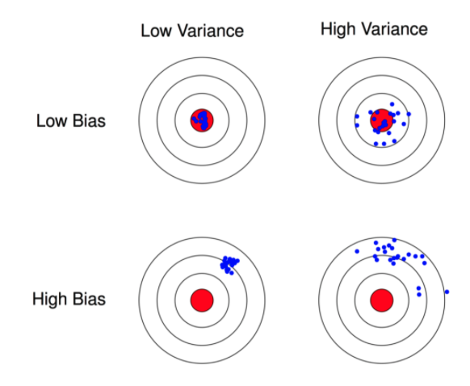
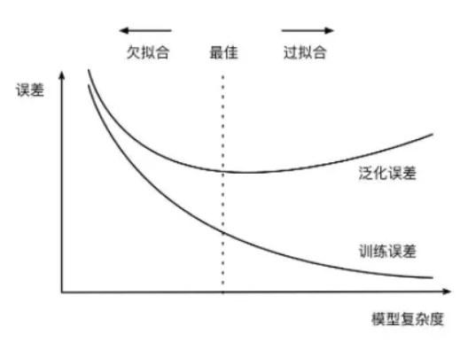
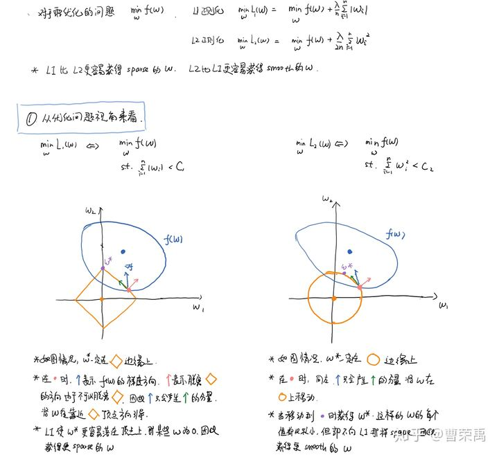
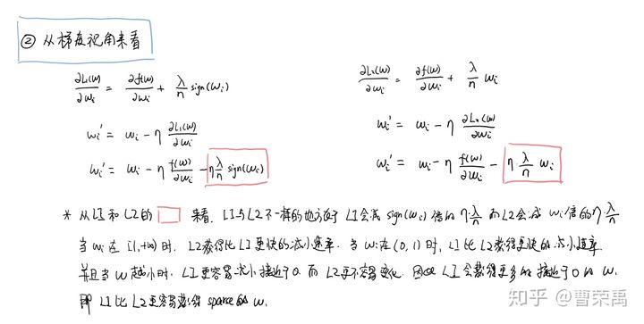
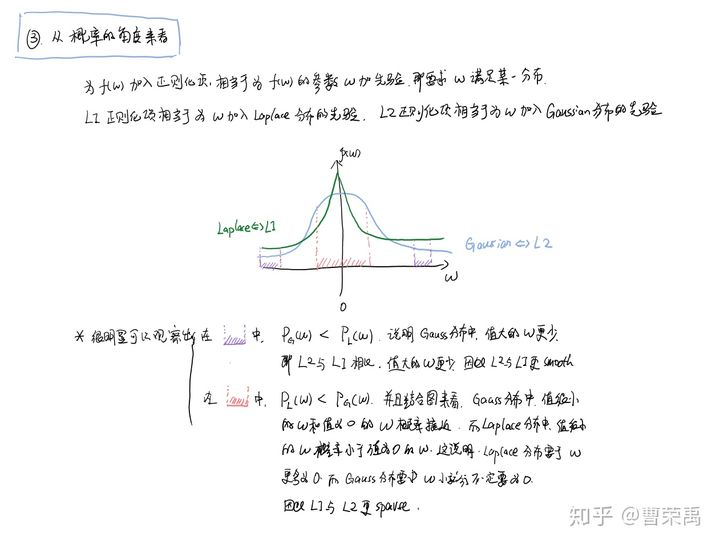
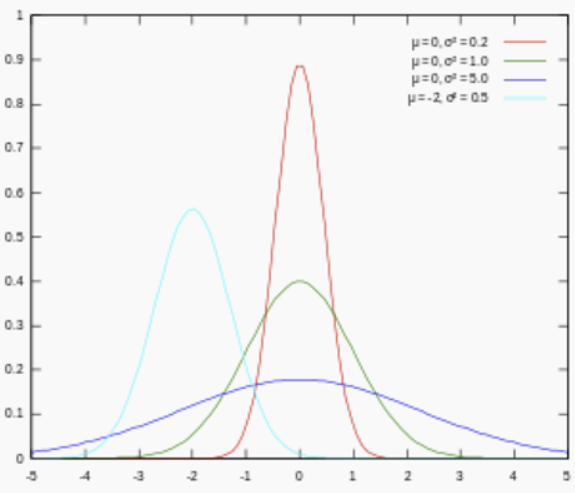
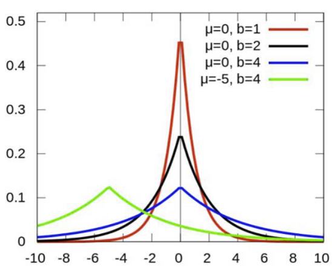

# 过拟合欠拟合面试题

## 1. 如何理解高方差与低偏差?

模型的预测误差可以分解为三个部分: 偏差(bias)， 方差(variance) 和噪声(noise).

**偏差**

- 偏差度量了`模型的期望预测与真实结果的偏离程度`， 即刻画了学习`算法本身的拟合能力`。偏差则表现为在特定分布上的适应能力，偏差越大越偏离真实值。

**方差**

- 方差度量了`同样大小的训练集（不同数据集）的变动所导致的学习性能的变化`， 即刻画了`数据扰动所造成的影响`。方差越大，说明数据分布越分散。

**噪声**

- 噪声表达了在当前任务上任何模型所能达到的期望泛化误差的下界， 即刻画了学习问题本身的难度 。

  下图为**偏差和方差示意图**。

​                                                                                               

**泛化误差、偏差、方差和模型复杂度的关系**（图片来源百面机器学习）

参考资料：https://blog.csdn.net/simple_the_best/article/details/71167786

## 2. 什么是过拟合和欠拟合，为什么会出现这个现象

过拟合指的是在训练数据集上表现良好，而在未知数据上表现差。如图所示：

欠拟合指的是模型没有很好地学习到数据特征，不能够很好地拟合数据，在训练数据和未知数据上表现都很差。

过拟合的原因在于：

- 参数太多，模型复杂度过高；

- 建模样本选取有误，导致选取的样本数据不足以代表预定的分类规则；

- 样本噪音干扰过大，使得机器将部分噪音认为是特征从而扰乱了预设的分类规则；

- 假设的模型无法合理存在，或者说是假设成立的条件实际并不成立。

欠拟合的原因在于：

- 特征量过少；

- 模型复杂度过低。

## 3. 怎么解决欠拟合

- 增加新特征，可以考虑加入进特征组合、高次特征，来增大假设空间；

- 添加多项式特征，这个在机器学习算法里面用的很普遍，例如将线性模型通过添加二次项或者三次项使模型泛化能力更强；
  [sklearn.preprocessing.PolynomialFeatures--产生多项式和交互式特征](https://scikit-learn.org/stable/modules/generated/sklearn.preprocessing.PolynomialFeatures.html#sklearn.preprocessing.PolynomialFeatures)

- 减少正则化参数，正则化的目的是用来防止过拟合的，但是模型出现了欠拟合，则需要减少正则化参数；
- 使用非线性模型，比如核SVM 、决策树、深度学习等模型；
- 调整模型的容量(capacity)，通俗地，模型的容量是指其拟合各种函数的能力(模型搞得更复杂点~容量低的模型可能很难拟合训练集)；

## 4. 怎么解决过拟合（重点）

- **获取和使用更多的数据（数据集增强）**——解决过拟合的根本性方法 

- 特征降维:人工选择保留特征的方法对特征进行降维

- 加入正则化，控制模型的复杂度

- Dropout

- Early stopping

- 交叉验证
- 增加噪声

## 5. 为什么参数越小代表模型越简单？

<u>因为参数的稀疏，在一定程度上实现了特征的选择。</u>

越复杂的模型，越是会尝试对所有的样本进行拟合，甚至包括一些异常样本点，这就容易造成在较小的区间里预测值产生较大的波动，这种较大的波动也反映了在这个区间里的导数很大，而只有较大的参数值才能产生较大的导数。因此复杂的模型，其参数值会比较大。 因此参数越少代表模型越简单。

## 6. 为什么L1比L2更容易获得稀疏解？（重点）

参考链接： https://www.zhihu.com/question/37096933/answer/475278057

## 7. Dropout为什么有助于防止过拟合？（重点）

* 取平均的作用

  先回到标准的模型即没有dropout，我们用相同的训练数据去训练5个不同的神经网络，一般会得到5个不同的结果，此时我们可以采用 “5个结果取均值”或者“多数取胜的投票策略”去决定最终结果。例如3个网络判断结果为数字9，那么很有可能真正的结果就是数字9，其它两个网络给出了错误结果。这种“综合起来取平均”的策略通常可以有效防止过拟合问题。因为不同的网络可能产生不同的过拟合，取平均则有可能让一些“相反的”拟合互相抵消。<u>dropout掉不同的隐藏神经元就类似在训练不同的网络，随机删掉一半隐藏神经元导致网络结构已经不同，整个dropout过程就相当于对很多个不同的神经网络取平均。而不同的网络产生不同的过拟合，一些互为“反向”的拟合相互抵消就可以达到整体上减少过拟合</u>。

* 减少神经元之间复杂的共适应关系

  因为dropout程序导致两个神经元不一定每次都在一个dropout网络中出现。这样权值的更新不再依赖于有固定关系的隐含节点的共同作用，阻止了某些特征仅仅在其它特定特征下才有效果的情况 。迫使网络去学习更加鲁棒的特征 ，这些特征在其它的神经元的随机子集中也存在。换句话说假如我们的神经网络是在做出某种预测，它不应该对一些特定的线索片段太过敏感，即使丢失特定的线索，它也应该可以从众多其它线索中学习一些共同的特征。从这个角度看`dropout就有点像L1，L2正则，减少权重使得网络对丢失特定神经元连接的鲁棒性提高`。

* Dropout类似于性别在生物进化中的角色

  物种为了生存往往会倾向于适应这种环境，环境突变则会导致物种难以做出及时反应，性别的出现可以繁衍出适应新环境的变种，有效的阻止过拟合，即避免环境改变时物种可能面临的灭绝。

 参考链接：https://zhuanlan.zhihu.com/p/38200980

## 8. Dropout在训练和测试时都需要吗？

**Dropout在训练时采用**，是为了减少神经元对部分上层神经元的依赖，类似将多个不同网络结构的模型集成起来，减少过拟合的风险。而在测试时，应该用整个训练好的模型，因此不需要dropout。

## 9. Dropout如何平衡训练和测试时的差异呢？（没理解~）

Dropout 在训练时以一定的概率使神经元失活，实际上就是让对应神经元的输出为0。假设失活概率为 p ，就是这一层中的每个神经元都有p的概率失活。

例如在三层网络结构中，如果失活概率为0.5，则平均每一次训练有3个神经元失活，所以输出层每个神经元只有3个输入，而实际测试时是不会有dropout的，输出层每个神经元都有6个输入。

**因此在训练时还要对第二层的输出数据除以（1-p）之后再传给输出层神经元，作为神经元失活的补偿，以使得在训练时和测试时每一层输入有大致相同的期望。**

## 10. BN和Dropout共同使用时会出现的问题

最好别一起用~

BN和Dropout单独使用都能减少过拟合并加速训练速度，但如果一起使用的话不会产生1+1>2的效果，相反可能会得到比单独使用更差的效果。

有2种方案：
 - BN层后用dropout；
 - 高斯dropout；

参考链接：https://www.zhihu.com/tardis/sogou/art/61725100

## 11. L1 和 L2 正则先验分别服从什么分布

先验就是优化的起跑线， 有先验的好处就是可以在较小的数据集中有良好的泛化性能，当然这是在先验分布是接近真实分布的情况下得到的了，从信息论的角度看，向系统加入了正确先验这个信息，肯定会提高系统的性能。

L1 正则先验分布是 Laplace 分布，L2 正则先验分布是 Gaussian 分布。

Laplace 分布公式为:
$$
f(x)=\frac{1}{2 \lambda} e^{-\frac{|x-\mu|}{\lambda}}
$$

Gaussian 分布公式为:
$$
f(x)=\frac{1}{\sqrt{2 \pi} \sigma} \exp \left(-\frac{(x-\mu)^{2}}{2 \sigma^{2}}\right)
$$

对参数引入高斯正态先验分布相当于L2正则化：

对参数引入拉普拉斯先验等价于 L1正则化： 

从上面两图可以看出， L2先验趋向零周围， L1先验趋向零本身。

参考链接：https://blog.csdn.net/akenseren/article/details/80427471
